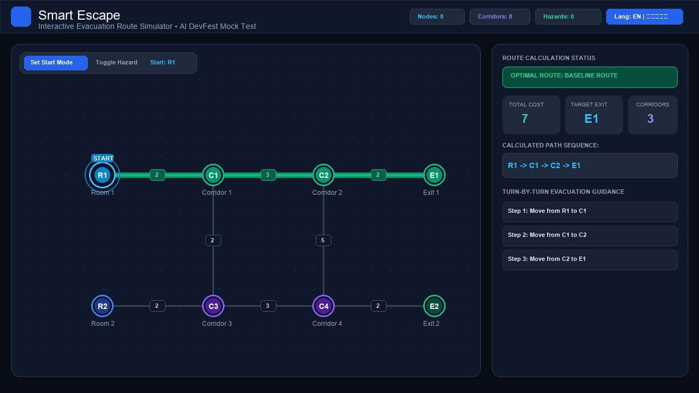
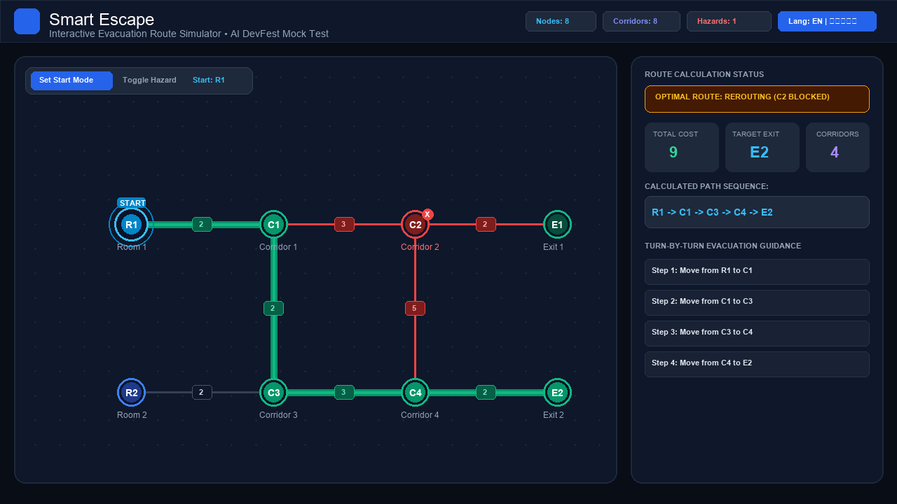

# Smart Escape - Interactive Evacuation Route Simulator

> **AI DevFest Solo Mock Test / Practice Challenge**  
> *Build an interactive map. Compute routes. Respond to changing hazards.*

---

## 📌 Participant Information

| Field | Value |
|---|---|
| **Full Name** | [Your Name] |
| **Registration Number** | 262-15-944 |
| **GitHub Repository** | `devfest-262-15-944` |
| **Live Web Application** | `https://ahanafanower70-hash.github.io/devfest-262-15-944/` |
| **Final Commit ID** | `88e94a2` |

---

## 🚀 Quick Start & Installation

This project is a browser-only, zero-dependency client-side application. You can run it immediately with Node.js/NPM or any static HTTP server.

### 1. Clone & Install
```bash
git clone https://github.com/ahanafanower70-hash/devfest-262-15-944.git
cd devfest-262-15-944
npm install
```

### 2. Run Local Development Server
```bash
npm run dev
```
The server will start at: `http://localhost:8000` (or `http://localhost:5173`).

### 3. Production Build / Preview
```bash
npm run build
npm start
```
*Note: Because this is a lightweight, pure client-side web application, you can also directly open `index.html` in Chrome, Edge, Safari, or Firefox without any build step.*

---

## ✨ Key Features Implemented

1. **Interactive SVG Building Map & Weighted Edges Visualization:**
   - Automatically auto-fits and centers nodes at their supplied $(x, y)$ coordinates.
   - Smooth mouse pan, scroll-wheel zoom, and fit-to-screen controls.
   - Visual distinction for node types: **Rooms** (Blue `#3B82F6`), **Junctions** (Purple `#8B5CF6`), and **Exits** (Emerald Green `#10B981`).
   - Corridors displayed with interactive midpoint integer cost badges.
   - Pulsing beacon highlight on the active start node and glowing animated directional dashes on the active evacuation route.

2. **Dijkstra Shortest Path Engine with Deterministic Tie-Breaking:**
   - **Cost Metric:** Sum of edge costs along the path (Euclidean distance is strictly avoided).
   - **Exclusions:** Excludes `blocked_nodes` (and all incident corridors), `blocked_edges`, and `closed_exits` (prohibited as destinations or intermediate steps).
   - **Deterministic Tie-Breaking Rules (AI DevFest Section 3.3):**
     1. Primary: Choose the reachable open exit with the **lowest total path cost**.
     2. Secondary (Equal Cost): Choose the exit with the **lexicographically smallest exit ID** (e.g., `'E1'` over `'E2'`).
     3. Tertiary (Equal Cost & Same Exit): Choose the node sequence that is **lexicographically smallest element-by-element** (e.g., `['R1', 'C1', 'E1']` over `['R1', 'C3', 'E1']`).
   - **Clear Failure State Reporting:**
     - Displays `"Starting location blocked"` if the chosen start node is blocked.
     - Displays `"No route available"` if all open exits are unreachable.

3. **Real-Time Dynamic Hazard Toggles:**
   - Click nodes or corridors on the map, or use the sidebar Hazard Manager list.
   - Distinct visual hazard indicators: red cross badges on blocked nodes, red dashed strikethrough lines on blocked corridors, and lock icons on closed exits.
   - **Reset Hazards:** Restores hazards to the original `initial_state` defined in the loaded JSON file.

4. **Bilingual UI Support (Bangla & English):**
   - Instant header toggle between **English** and **বাংলা**.
   - Fully translated labels, action buttons, hazard panels, tooltips, error banners, and turn-by-turn guidance.
   - Standard node IDs (e.g., `R1`, `C1`, `E1`) remain consistent across languages.

5. **Custom JSON Import & Validation (`building.json`):**
   - Strict validation checking: non-empty building name, node limits ($2 \le N \le 60$), corridor limits ($1 \le E \le 150$), self-loop prevention, duplicate node pair rejection, positive integer edge costs, and initial state category matching.
   - User-friendly error banners on malformed or inconsistent inputs.

---

## 📸 Screenshots

### Baseline Evacuation Route (`R1` &rarr; `E1`)

*Baseline calculation from start room `R1` to open exit `E1` with total cost 7.*

### Dynamic Reroute after Junction `C2` Blocked (`R1` &rarr; `E2`)

*When junction `C2` is blocked, system reroutes via `C3` and `C4` to exit `E2` (Cost: 11).*

---

## 🧪 Test Scenarios Verification Matrix

Tested against Section 4.1 of the AI DevFest Official Rulebook:

| Scenario | Action | Expected Result | Actual Result | Verification Status |
|---|---|---|---|:---:|
| **Baseline** | Select `R1` | `R1 - C1 - C2 - E1; cost 7` | `R1 - C1 - C2 - E1; cost 7` | **PASS** ✅ |
| **Blocked junction** | Select `R1`; block `C2` | `R1 - C1 - C3 - C4 - E2; cost 11` | `R1 - C1 - C3 - C4 - E2; cost 11` | **PASS** ✅ |
| **Exits closed** | Select `R1`; close `E1` and `E2` | `No route available` | `No route available` | **PASS** ✅ |
| **Different start** | Select `R2` | `R2 - C3 - C4 - E2; cost 7` | `R2 - C3 - C4 - E2; cost 7` | **PASS** ✅ |
| **Blocked start** | Select `R1`; then block `R1` | `Starting location blocked` | `Starting location blocked` | **PASS** ✅ |

---

## 🕒 Git Commit Log Strategy (90-Minute Competition Timeline)

To adhere to the AI DevFest Rulebook Section 05 (committing at least once every 30 minutes with at least three commits in total):

- **Commit 1 (T+25 min):**  
  `feat: setup project structure, json importer and svg map rendering | AI Prompt: Initial scaffolding`  
  *Sets up repository structure, building.json parser, SVG canvas, and pan/zoom coordinates mapping.*

- **Commit 2 (T+55 min):**  
  `feat: implement dijkstra routing, tie-breaking logic, dynamic hazard toggles and status handling | AI Prompt: Routing & hazards`  
  *Implements Dijkstra engine with deterministic tie-breaking, hazard toggling, and failure state banners.*

- **Commit 3 (T+85 min):**  
  `feat: add bilingual support, readme, license, screenshots and final polished styling | Manual edit`  
  *Adds Bangla/English i18n, simulation walkthrough, test runner modal, documentation, MIT license, and submission screenshots.*

---

## 🤖 AI Tools & Prompt Log

- **AI Assistant:** Antigravity AI Coding Assistant (Gemini 3.8 Flash)
- **Primary / Most Useful Prompt:**
  ```text
  "Implement a custom Dijkstra shortest path algorithm in JavaScript for an undirected graph
   with multi-tier deterministic tie-breaking:
   1. Minimum path cost sum
   2. Lexicographically smallest exit ID
   3. Lexicographically smallest node sequence element-by-element
   Ensure blocked nodes, blocked edges, and closed exits are excluded as both intermediate nodes and destinations.
   Handle failure states: 'Starting location blocked' and 'No route available'."
  ```

---

## ⚠️ Known Issues & Future Enhancements

- **Known Limitations:**
  - In graphs where multiple nodes share identical $(x, y)$ coordinates in custom JSON files, node circles will visually overlap, though routing remains mathematically sound.
- **Future Enhancements:**
  - Real-time multi-agent simultaneous evacuation animation.
  - Floor-plan CAD / GeoJSON background overlay support.
  - Multi-floor staircase traversal transitions.

---

## 📄 License

This project is licensed under the [MIT License](LICENSE) - see the `LICENSE` file for details.
